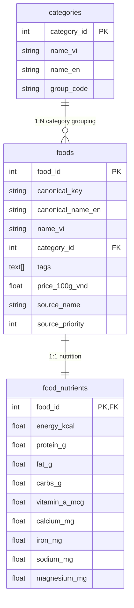

# Comprehensive Database Refactoring & Performance Optimization Plan

This document provides a technical blueprint for optimizing database performance, tag querying, and food categorization to support the CSP meal planning algorithm. It also analyzes the feasibility of introducing **ClickHouse** into the architecture.

---

## 1. Architectural Analysis: PostgreSQL vs. ClickHouse

### ClickHouse Feasibility Study
ClickHouse is a column-oriented OLAP database designed to query billions of rows. Introducing it for the food database raises several challenges:

| Criteria | PostgreSQL | ClickHouse | Recommendation / Analysis |
|---|---|---|---|
| **Dataset Size** | Perfect for small/medium datasets. | Designed for terabytes of data (billions of rows). | Our VDD food database has exactly **853 rows**. Loading this table in ClickHouse introduces significant overhead without performance benefits. |
| **Lookup Latency** | **< 1ms** with primary key indexes. | Optimized for table scans and aggregations, not fast point-lookups. | CSP needs fast point-lookups for specific food IDs. Postgres is faster here. |
| **Complexity** | Simple, already integrated in docker-compose. | Requires setup, zookeeper/clickhouse-keeper, syncing pipeline. | ClickHouse introduces a high maintenance overhead for no real benefit on small tables. |
| **Resource Usage** | Lightweight (~100-200MB RAM). | Heavy memory consumption (minimum ~1-2GB RAM). | Overkill for a web backend running on limited resources. |

> [!TIP]
> **Conclusion**: ClickHouse is **not recommended** for the core food database or candidate lookups. However, if the system grows and needs to analyze **millions of user search logs or solver performance metrics**, ClickHouse can be introduced as an analytical layer for logging. For the meal planner, PostgreSQL combined with in-memory caching is the optimal choice.

---

## 2. PostgreSQL Optimization Strategy

To achieve **sub-millisecond or zero-query latency** during CSP execution, we propose the following improvements:

### A. GIN Indexes on Tags
Instead of storing tags as a comma-separated text string or joining across a pivot table, we store them as a native PostgreSQL text array (`tags text[]`) and create a **GIN (Generalized Inverted Index)**:

```sql
-- Migration snippet
ALTER TABLE foods ADD COLUMN tags text[];

-- Create GIN index for fast array matching
CREATE INDEX idx_foods_tags ON foods USING gin(tags);
```

This allows extremely fast lookups for tags:
```sql
-- Query foods with 'role_protein' that are NOT allergens
SELECT food_id FROM foods 
WHERE tags @> ARRAY['role_protein']::text[] 
  AND NOT (tags && ARRAY['allergen_seafood', 'allergen_egg']::text[]);
```
*Latency: < 0.1ms*

### B. In-Memory RAM Caching (0ms Latency)
Since the entire VDD dataset (853 rows) is less than **1MB**, we can load the entire database into memory (RAM) in a Python singleton during backend startup:

```python
class InMemoryFoodCache:
    """Singleton cache of the entire food database, loaded at startup."""
    _instance = None
    
    def __new__(cls):
        if cls._instance is None:
            cls._instance = super().__new__(cls)
            cls._instance.foods = {}
            cls._instance.by_tag = {}
        return cls._instance
        
    def load(self, db_url):
        # Fetch all 853 items from DB once
        # Populates lookup dicts
        self.foods = {f["food_id"]: f for f in query_all_foods(db_url)}
```
*Latency: 0.0ms (direct dictionary lookup in RAM, completely bypassing network/database).*

---

## 3. Database Schema Refactoring

We propose updating the schema in `data/sql/init/001_schema.sql` to support the new grouping and array tags natively:



### Key Refactorings:
1. **Consolidated Category Tree**: Use VDD categories as first-class citizens in a dedicated `categories` table.
2. **First-Class Tags Array**: Move from pivot table (`food_tag_mapping`) to direct `tags text[]` array column on `foods` table, indexed with GIN.
3. **Optimized Nutrient Table**: Limit columns in `food_nutrients` to the core nutrients tracked by the application, dropping unused micronutrient columns to keep the database footprint small.

---

## 4. Migration Plan

### Phase 1: Update SQL Schemas
- Modify `data/sql/init/001_schema.sql` to include `tags text[]` on `foods` and drop `food_tag_mapping`.
- Update `data/sql/init/002_seed_categories.sql` with the new VDD categories.

### Phase 2: Refactor DB Loader
- Update `data/scripts/load_structured_to_db.py` to read `data/raw/viendinhduong_nutrients.csv` and insert tags directly as PG arrays.

### Phase 3: Implement In-Memory Caching
- Integrate the startup cache in `FeatureStore` or `MealPlanPipeline` to eliminate SQL queries during solver run.
