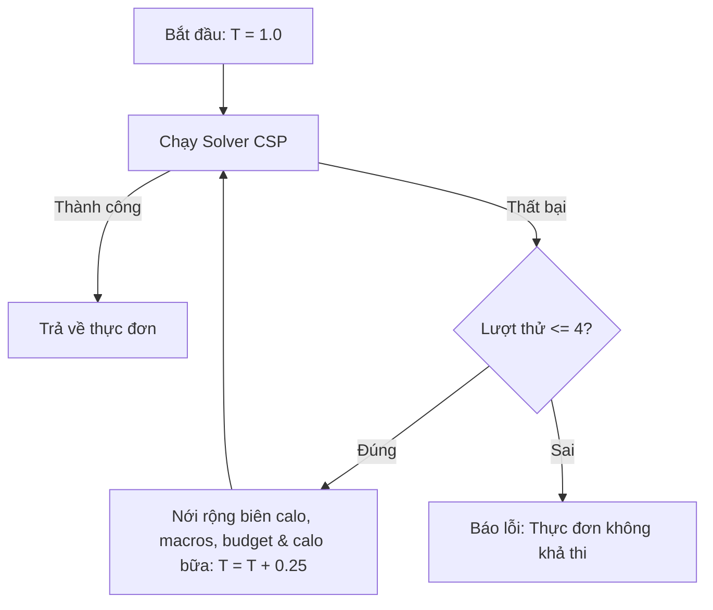

# Tài liệu Hệ thống Ràng buộc trong Thuật toán CSP (Meal Plan Constraints)

Tài liệu này tổng hợp toàn bộ các ràng buộc (Constraints) được áp dụng trong thuật toán Lập lịch Thực đơn (CSP Solver - `MealScheduler`) để đưa ra thực đơn dinh dưỡng 7 ngày tối ưu cho người dùng.

Hệ thống ràng buộc được chia làm hai loại chính:
1. **Ràng buộc cứng (Hard Constraints)**: Bắt buộc phải thỏa mãn. Nếu không tìm được lời giải, hệ thống sẽ thực hiện cơ chế nới lỏng tự động (Auto-Relaxation) theo chu kỳ tăng dần.
2. **Ràng buộc mềm / Phạt điểm (Soft Constraints / Penalties)**: Dùng để xếp hạng và lựa chọn thực đơn tối ưu nhất về độ đa dạng món ăn và thói quen ẩm thực Việt Nam.

---

## 1. Ràng buộc cứng (Hard Constraints)

### 1.1 Ràng buộc Năng lượng (Daily Calories)
* **Mô tả**: Tổng lượng calo của tất cả món ăn trong một ngày phải nằm trong biên độ cho phép xung quanh mục tiêu hàng ngày của người dùng.
* **Công thức**:
  $$\text{Calo mục tiêu} \times (1 - \text{Sai số calo} \times t) \le \text{Tổng calo thực tế} \le \text{Calo mục tiêu} \times (1 + \text{Sai số calo} \times t)$$
  - Sai số calo mặc định: $12\%$ (`calorie_tolerance_pct = 0.12`).
  - Hệ số nới lỏng ($t$): Khởi chạy từ $1.0$ (Attempt 1) và tăng thêm $0.25$ sau mỗi nỗ lực giải thất bại.

### 1.2 Ràng buộc Tỷ lệ Nhóm chất (Macros Balance)
* **Mô tả**: Đảm bảo sự phân bổ cân bằng giữa Đạm (Protein), Chất béo (Fat), và Tinh bột (Carbs) dựa trên tỷ lệ mục tiêu (Ví dụ mặc định: 30% Protein / 30% Fat / 40% Carbs).
* **Phương pháp kiểm tra**:
  1. **Độ lệch đơn lẻ tối đa (Per-macro Hard Floor/Ceiling)**: Tránh mất cân bằng cực đoan (Ví dụ: 0% béo hoặc 80% tinh bột). Độ lệch tuyệt đối của từng nhóm chất so với mục tiêu không được vượt quá:
     $$\text{Độ lệch tối đa} = \text{Sai số macro mặc định (12\%)} \times t + 8\%$$
  2. **Tổng ngân sách độ lệch (Total Deviation Budget)**: Tổng độ lệch tuyệt đối của cả 3 nhóm chất không được vượt quá:
     $$\sum |\text{Tỷ lệ thực tế}_i - \text{Tỷ lệ mục tiêu}_i| \le \text{Sai số macro mặc định (12\%)} \times t \times 2.5$$

### 1.3 Ràng buộc Dị ứng & Thành phần Loại trừ (Allergies & Exclusions)
* **Mô tả**: Loại bỏ hoàn toàn các món ăn chứa thành phần gây dị ứng hoặc thành phần người dùng chủ động loại trừ.
* **Bản đồ Ánh xạ Allergen Tag**:
  Các từ khóa người dùng nhập vào được tự động chuẩn hóa sang các tag allergen tương ứng trong cơ sở dữ liệu:

  | Nhóm Dị ứng | Từ khóa Tiếng Việt / Tiếng Anh | Tag trong Database |
  | :--- | :--- | :--- |
  | **Hải sản (Seafood)** | hải sản, cá, tôm, cua, seafood, fish, shrimp, crab | `allergen_seafood` |
  | **Trứng (Egg)** | trứng, egg, eggs, yolk, white | `allergen_egg` |
  | **Đậu phộng (Peanut)** | lạc, đậu phộng, peanut, peanuts | `allergen_peanut` |
  | **Sữa (Milk)** | sữa, bơ, phô mai, milk, butter, cheese, whey | `allergen_milk` |
  | **Đậu nành (Soy)** | đậu nành, đậu phụ, tofu, soy, soya | `allergen_soy` |
  | **Lúa mì (Wheat)** | lúa mì, bột mì, bánh mì, wheat, gluten, bread | `allergen_wheat` |
  | **Thịt đỏ (Beef/Pork)** | bò, heo, lợn, beef, pork | `allergen_beef`, `allergen_pork` |
  | **Thịt gia cầm** | gà, vịt, chicken, duck | `allergen_chicken`, `allergen_duck` |

* **Tìm kiếm tùy biến (Custom Allergies)**: Đối với các từ khóa không thuộc bảng ánh xạ trên, hệ thống sẽ thực hiện kiểm tra chuỗi con (substring match) không phân biệt hoa thường trực tiếp trên tên tiếng Anh, tên tiếng Việt, và danh mục món ăn để lọc bỏ.

### 1.4 Ràng buộc Ngân sách hàng ngày (Daily Budget)
* **Mô tả**: Kiểm soát chi phí thực tế của thực đơn trong ngày.
* **Biên giới hạn**:
  - **Giới hạn trên**: $\text{Tổng chi phí thực đơn} \le \text{Ngân sách tối đa} \times t$.
  - **Giới hạn dưới (Sàn)**: Tránh thực đơn quá rẻ/thiếu chất lượng (chỉ áp dụng ở lượt giải đầu tiên $t = 1.0$):
    $$\text{Tổng chi phí thực đơn} \ge \text{Ngân sách tối đa} \times 40\%$$

### 1.5 Ràng buộc Phân bổ Calo theo Bữa (Calorie Distribution)
* **Mô tả**: Đảm bảo năng lượng nạp vào phân bổ khoa học giữa các bữa chính trong ngày để duy trì đường huyết ổn định.
* **Tỷ lệ phân bổ mặc định**:
  - **Bữa sáng (Breakfast)**: $15\% - 35\%$ tổng calo ngày.
  - **Bữa trưa (Lunch)**: $25\% - 45\%$ tổng calo ngày.
  - **Bữa tối (Dinner)**: $25\% - 45\%$ tổng calo ngày.
* **Nới lỏng khi thất bại**: Nếu $t > 1.0$, biên trên và biên dưới của mỗi bữa sẽ được nới lỏng thêm một khoảng: $\Delta = (t - 1.0) \times 5\%$.

---

## 2. Ràng buộc Kỹ thuật & Khối lượng Khẩu phần

### 2.1 Giới hạn Khối lượng Ăn tối đa (Serving Size Weight Limits)
* **Mô tả**: Giới hạn trọng lượng (g) tối đa cho phép của một thành phần món ăn trong một bữa ăn để bảo đảm tính thực tế và khoa học (Ví dụ: không thể ăn 500g bột whey hoặc bơ trong một bữa).
* **Bảng giới hạn định lượng theo Tag**:

  | Loại thực phẩm | Trọng lượng tối đa (g) / bữa | Ví dụ minh họa |
  | :--- | :--- | :--- |
  | **Khô / Sấy / Bột dinh dưỡng** | $30\text{ g}$ | Mít sấy, bột mì, bột whey protein |
  | **Bơ, phô mai, sữa đặc** | $50\text{ g}$ | Phô mai lát, bơ lạt, sữa đặc Ông Thọ |
  | **Tiết luộc** | $150\text{ g}$ | Tiết heo luộc, tiết bò |
  | **Đồ chế biến sẵn / Ăn vặt / Tráng miệng** | $150\text{ g}$ | Lạp xưởng, xúc xích ăn liền, bánh ngọt |
  | **Rau xanh & Chất xơ** | $250\text{ g}$ | Cải ngồng xào tỏi, rau muống luộc |
  | **Tinh bột chính (Carbs)** | $300\text{ g}$ | Cơm trắng, bún tươi, phở tươi |
  | **Chất đạm chính (Protein)** | $450\text{ g}$ (Gym) / $350\text{ g}$ (Thường) | Ức gà luộc, thịt bò xào |
  | **Các thực phẩm khác** | $300\text{ g}$ | Trái cây tươi, khoai tây luộc |

### 2.2 Loại trừ Nguyên liệu thô (Raw Ingredients Filter)
* **Mô tả**: Core Domain (món chính đại diện cho bữa sáng, trưa, tối) của Solver phải là các món ăn đã qua chế biến, không thể là nguyên liệu thô chưa nấu.
* **Từ khóa loại trừ**: Bất kỳ thực phẩm nào chứa từ khóa sau trong tên sẽ bị loại bỏ khỏi danh sách món chính: `sống`, `raw`, `bột`, `powder`, `tinh bột`, `starch`, `flour`, `chưa chế biến`. (Ví dụ: *Gạo tẻ sống* bị loại, nhưng *Cơm trắng* hoặc *Cháo* được giữ lại).

### 2.3 Phân bổ bữa phụ (Snacks Exclusion)
* **Mô tả**: Hệ thống hỗ trợ cờ cấu hình `exclude_snacks = True` từ phía người dùng để tắt hoàn toàn bữa phụ. Khi bật, solver chỉ lập lịch cho 3 bữa chính là Breakfast, Lunch, Dinner.

---

## 3. Ràng buộc Đặc biệt cho Người tập Gym (Gym Profile Constraints)

Hệ thống tự động phát hiện đối tượng người dùng tập Gym thông qua calo mục tiêu ($\ge 2800\text{ kcal}$), mục tiêu là `gym` hoặc tin nhắn đầu vào chứa từ `gym`.

* **Yêu cầu Đạm chất lượng cao (High Quality Protein)**: Bắt buộc cả hai bữa ăn Trưa (Lunch) và Tối (Dinner) phải chứa tối thiểu một thành phần đạm chất lượng cao (clean protein - tag `clean_protein`).
* **Ví dụ Clean Protein**: Ức gà (`chicken breast`), thịt bò thăn (`beef tenderloin`), thịt nạc heo (`pork loin`), trứng gà (`egg`), cá hồi (`salmon`), cá ngừ (`tuna`), tôm tươi (`shrimp`), cua (`crab`).
* **Loại bỏ đồ ăn vặt & nội tạng**: Tự động thanh lọc các món ăn vặt, nhiều đường, hoặc nội tạng động vật ra khỏi danh sách chọn lựa của người tập Gym: `chè`, `mứt`, `kẹo`, `bim bim`, `pate`, `lạp xưởng`, `xúc xích`, `kem`, `sữa đặc`, `bơ`, `nước ngọt`, `tiết`, `lòng lợn`, `nội tạng`, `dồi`, `lòng vịt`.

---

## 4. Ràng buộc Mềm & Cơ chế Điểm phạt (Soft Constraints & Scoring)

Để tránh thực đơn nhàm chán và lặp lại liên tục, Solver áp dụng điểm phạt (Penalty) trừ trực tiếp vào điểm chất lượng tổng thể của thực đơn.

### 4.1 Phạt Tần suất xuất hiện trong Tuần (Weekly Frequency Penalty)
Ngoại trừ **cơm trắng / cơm tẻ** (cho phép lặp lại), các thực phẩm khác khi tái sử dụng trong tuần sẽ bị áp điểm phạt lũy tiến:
- Xuất hiện lần thứ 2: phạt $+40$ điểm.
- Xuất hiện lần thứ 3: phạt $+150$ điểm.
- Xuất hiện lần thứ 4 trở đi: phạt $+400$ điểm.
*Lưu ý*: Một món ăn đơn lẻ bị cấm xuất hiện quá 3 lần một tuần ở vòng kiểm duyệt cuối để đảm bảo đa dạng nguồn thực phẩm.

### 4.2 Phạt Lặp lại Ngày liên tiếp (Recency Penalty)
Món ăn đã ăn ở các ngày liền kề trước đó sẽ bị phạt cực nặng để ép solver tìm món khác:
- Trùng món với **1 ngày trước**: phạt $+200$ điểm.
- Trùng món với **2 ngày trước**: phạt $+80$ điểm.
- Trùng món với **3 ngày trước**: phạt $+30$ điểm.

### 4.3 Khuyến khích Món sáng truyền thống (Vietnamese Breakfast Boost)
* **Mô tả**: Tự động cộng thưởng điểm (bằng cách trừ đi phạt điểm $-60$) nếu món ăn được chọn làm bữa sáng thuộc các món ăn sáng truyền thống Việt Nam để tăng độ thực tế cho thực đơn.
* **Danh sách nhận diện**: Các món chứa từ khóa `bún`, `miến`, `phở`, `xôi`, `bánh mì`, `bánh mỳ`.

---

## 5. Cơ chế Nới lỏng Ràng buộc Tự động (Auto-Relaxation)

Khi không tìm ra giải pháp khả thi với các ràng buộc khắt khe ban đầu (ví dụ: người dùng đặt ngân sách quá thấp nhưng mục tiêu calo quá cao), hệ thống sẽ tăng dần hệ số nới lỏng ($t$):

- **Lượt 1 ($t = 1.0$)**: Ràng buộc nguyên bản (Calo lệch 12%, Macro lệch 12%, Budget nguyên bản, Bữa phân bổ chuẩn).
- **Lượt 2 ($t = 1.25$)**: Calo nới biên thành 15%, Macro lệch tối đa 15%, Budget tăng 25%, Calo bữa giãn rộng.
- **Lượt 3 ($t = 1.50$)**: Calo biên 18%, Macro lệch 18%, Budget tăng 50%.
- **Lượt 4 ($t = 1.75$)**: Calo biên 21%, Macro lệch 21%, Budget tăng 75%.
