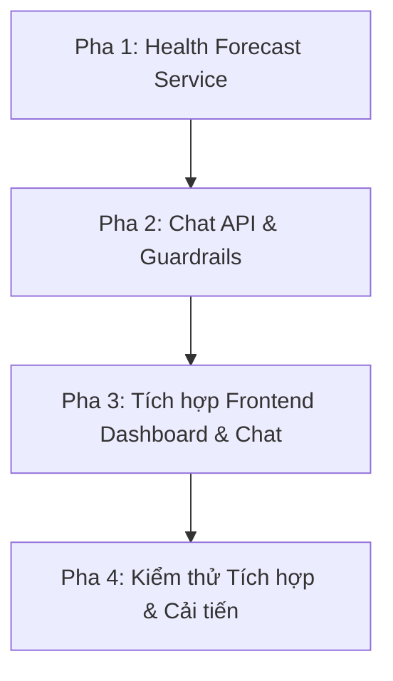

# Kế Hoạch Triển Khai Chi Tiết Các Giai Đoạn Tiếp Theo - NutriAdvisor_HUST

Tài liệu này vạch ra lộ trình triển khai chi tiết từng bước (Step-by-Step Roadmap) để đưa hệ thống NutriAdvisor_HUST từ các module lõi hiện tại thành một ứng dụng hoàn chỉnh, sẵn sàng tích hợp Frontend.

---

## 📋 Tóm Tắt Lộ Trình

---

## 1. Pha 1: Xây Dựng Service Dự Báo Sức Khỏe (Health Forecast Service)
*Mục tiêu: Đưa mô hình Random Forest đã huấn luyện vào sử dụng thực tế ở Backend FastAPI.*

### 🛠️ Các bước thực hiện:
1. **Tạo `health_forecaster.py`:**
   - Tạo file service tại `backend/app/services/health_forecaster.py`.
   - Viết logic tải mô hình tự động từ `models/health_predictor.pkl` khi khởi động ứng dụng.
2. **Xây dựng Logic Dự báo Lũy kế (Weekly Forecasting):**
   - Viết hàm nhận thông tin thể trạng hiện tại của người dùng (Chiều cao `height_cm`, Cân nặng `weight_kg`) và thực đơn tuần được tạo bởi CSP (để tính `Daily Calories Consumed`, `Daily Caloric Surplus/Deficit`).
   - Nhận thêm các biến sinh hoạt: `Sleep Quality` và `Stress Level`.
   - Dự đoán biến động cân nặng từ Tuần 1 đến Tuần 4 bằng cách gọi mô hình lặp với `Duration (weeks)` từ `1` đến `4`.
   - Tính toán chỉ số BMI tương ứng cho từng tuần:
     $$\text{Weight (kg)} = \text{Current Weight (kg)} + \frac{\text{Predicted Weight Change (lbs)}}{2.20462}$$
     $$\text{BMI} = \frac{\text{Weight (kg)}}{(\text{Height (m)})^2}$$
3. **Trích xuất Feature Importance:**
   - Trích xuất độ quan trọng của đặc trưng từ Random Forest thông qua thuộc tính `model.feature_importances_`.
4. **Xây dựng Endpoint `/api/v1/forecast`:**
   - Viết API endpoint trả về dữ liệu định dạng JSON Telemetry chuẩn (Output Format 3) để Frontend vẽ biểu đồ trực tiếp.

---

## 2. Pha 2: Tích Hợp Chat API & Phòng Tuyến Intent Guardrails (Chat API & NLP)
*Mục tiêu: Xây dựng cổng chat thông minh hỗ trợ 3 tính năng lõi và chặn hoàn toàn các yêu cầu ngoài luồng.*

### 🛠️ Các bước thực hiện:
1. **Xây dựng Endpoint `/api/v1/chat`:**
   - Viết API endpoint nhận tin nhắn dạng text của người dùng.
2. **Tích hợp Bộ Lọc Intent Guardrails (Task B):**
   - Gọi phương thức `IntentEngine.predict_chat_intent(user_query)`.
   - **Xử lý OUT_OF_SCOPE (Format 2):** Nếu intent trả về là `OUT_OF_SCOPE`, lập tức trả về phản hồi từ chối dưới định dạng JSON chuẩn.
3. **Phân phối Xử lý Ý định (Intent Routing):**
   - **`SUGGEST_MEAL`:** Điều hướng sang bộ gợi ý thực đơn nhanh 1 bữa dựa trên calo/macro mong muốn.
   - **`QUERY_NUTRITION`:** Trích xuất tên món ăn (`food_items`) và chất dinh dưỡng (`nutrients`), gọi hàm truy vấn cơ sở dữ liệu để trả về hàm lượng dinh dưỡng chính xác.
   - **`FIND_ALTERNATIVE`:** Trích xuất món ăn muốn thay thế (`replacement_target`), sử dụng `KNNRecommender` (Content-based) để gợi ý danh sách 5 món ăn thay thế có độ tương đồng dinh dưỡng cao nhất kèm điểm số tương quan.

---

## 3. Pha 3: Thiết Kế & Tích Hợp Frontend (Frontend UI Integration)
*Mục tiêu: Đưa dữ liệu từ API lên giao diện người dùng trực quan.*

### 🛠️ Các bước thực hiện:
1. **Thiết kế Biểu đồ Dự báo Thể trạng (Forecast Dashboard):**
   - Sử dụng thư viện Recharts (hoặc Chart.js) để vẽ biểu đồ đường (Line Chart) kép biểu diễn **Cân nặng dự báo** và **Chỉ số BMI dự báo** qua 4 tuần tiếp theo.
   - Vẽ biểu đồ cột ngang (Bar Chart) biểu diễn **Feature Importance** (Ví dụ: Thể hiện Stress Level ảnh hưởng bao nhiêu % đến cân nặng của họ).
2. **Xây dựng Khung Chatbot Tư vấn (Chat Interface):**
   - Thiết kế widget chat góc phải màn hình, hỗ trợ hiển thị tin nhắn của người dùng và câu trả lời của bot.
   - Xử lý định dạng hiển thị cho các tin nhắn bị từ chối (`OUT_OF_SCOPE`) bằng màu sắc cảnh báo nhẹ nhàng kèm theo gợi ý các chức năng hệ thống hỗ trợ.
   - Hỗ trợ hiển thị dạng thẻ (Cards) khi chatbot trả về danh sách món ăn thay thế (từ ý định `FIND_ALTERNATIVE`).

---

## 4. Pha 4: Kiểm Thử Tích Hợp & Tối Ưu Hóa Hệ Thống
*Mục tiêu: Đảm bảo toàn bộ hệ thống hoạt động ổn định dưới tải cao.*

### 🛠️ Các bước thực hiện:
1. **Viết Integration Tests:**
   - Tạo file test tại `tests/integration/test_chat_pipeline.py`.
   - Giả lập các câu hỏi của người dùng cho cả 3 nhóm hợp lệ và các câu hỏi rác để kiểm thử độ nhạy của bộ Intent Guardrails.
   - Kiểm tra xem KNN Recommender có trả về món thay thế chính xác khi tích hợp qua Chat API hay không.
2. **Tối ưu hóa Cache:**
   - Tối ưu hóa thời gian sống (TTL) của Redis cache cho từng loại intent để giảm thiểu số lần gọi API Gemini đắt đỏ.
3. **Giám sát hiệu năng (Monitoring):**
   - Ghi log thời gian phản hồi (Response Time) của Chat API để tối ưu hóa truy vấn SQL và tính toán KNN.
